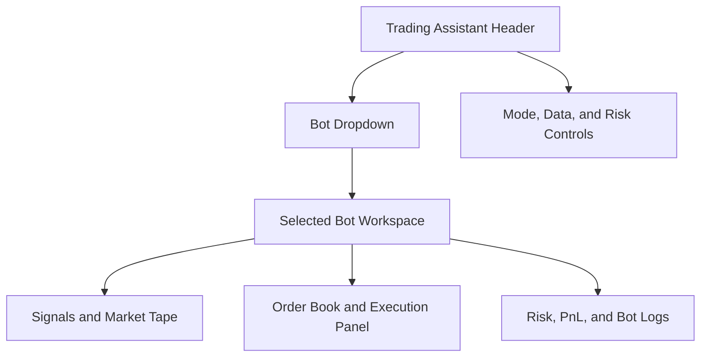

# Trading Bots Master Roadmap

Date: 2026-08-23
Branch: `trading_bot`
Status: Phase 1/2 implementation in progress

## Current Build Status

| Item | Status | Implementation note |
|---|---|---|
| Master roadmap | Done | `docs/roadmaps/trading-bots-master.md` created and updated as tasks land |
| `TRADING_ASSISTANT` nav group | Done | Added to `src/lib/nav.ts` after `DESK` |
| `TASSIST` route | Done | Added to `src/App.tsx` and `settings/modules.config.json` |
| `POLYBOT` default dropdown | Done | `Polymarket` is the first/default bot in `/trading-assistant` |
| Research/Paper/Live mode control | Done | `Research` default; `Live` disabled |
| SIM data toggle | Done | Uses `useSimMode()` and existing `qit-sim-mode` localStorage flag |
| Polymarket market/event APIs | Done | Existing routes now call public Gamma discovery with SIM fallback |
| Polymarket CLOB book API | Done | Added `/api/polymarket/book` for selected YES-token depth with SIM fallback |
| `POLYBOT` logic extraction | Done | Added `src/data/polybot.ts` for signals, books, positions, and risk checks |
| Paper ledger contracts | Done | Added `src/data/paperLedger.ts` for order, fill, event, and snapshot types |
| Server paper ledger | Done for first build | Added in-process server ledger in `src/server/paperLedger.ts` with orders, fills, events, positions, exposure, and P&L |
| Paper ledger APIs | Done for first build | Added `GET/POST/DELETE /api/trading-assistant/paper/orders` and `GET /api/trading-assistant/paper/positions` |
| Paper positions and P&L | Done for first build | Computed from server ledger snapshot, with browser local fallback if the paper API is unavailable |
| Hard paper risk gates | Done for first build | Ticket disabled client-side and recheckeded server-side before simulated fills |
| Paper ledger tests | Done for first build | Added deterministic Vitest coverage for server ledger fills/rejections/reset/P&L, API routes, local fallback, and `TASSIST` nav contract |
| Live execution | Not started | Must remain disabled until credentials, risk gates, approvals, and kill switch exist |

## Purpose

Create a durable planning document for all trading bot builds inside QuantMeridian. The first bot is a Polymarket trading assistant that starts with free/public Polymarket APIs, runs in read-only and paper-trading modes first, and only later supports authenticated live execution behind explicit risk gates.

This document tracks:

- Bot inventory, ownership, maturity, and next implementation steps.
- Shared terminal UX for selecting and operating bots.
- Data, API, risk, execution, and monitoring standards.
- The first full build plan: `POLYBOT`, a Polymarket trading bot using public Gamma/CLOB market data.

## Implementation Notes

### Navigation and Routing

`Trading Assistant` is now a first-class terminal group, not a subpanel inside `POLY`.

| File | Change |
|---|---|
| `src/lib/nav.ts` | Added `TRADING_ASSISTANT` to `NavItem["group"]`; added `TASSIST` nav item; added `Trading Assistant` to `NAV_GROUPS` |
| `settings/modules.config.json` | Added enabled `TASSIST` module toggle |
| `src/App.tsx` | Imported `TradingAssistant` and routed `/trading-assistant` behind `on("TASSIST")` |
| `src/app/trading-assistant/page.tsx` | Added first `POLYBOT` workspace shell |

### `POLYBOT` File Map

| Layer | File | Current role | Next likely extraction |
|---|---|---|---|
| Page/UI | `src/app/trading-assistant/page.tsx` | Bot dropdown, mode selector, SIM toggle, signal queue, selected market panel, CLOB/SIM book, server-ledger paper ticket, paper ledger, positions/P&L, reset control, run log | Split into `components/trading-assistant/*` once the page grows |
| Bot domain logic | `src/data/polybot.ts` | Bot options, risk profiles, signal scoring, book normalization, paper position/P&L accounting, hard paper risk checks | Add unit tests and configurable signal weights |
| Paper ledger contracts | `src/data/paperLedger.ts` | Shared order intent, fill, event, snapshot, and storage/source types | Extend with run records when signal endpoint exists |
| Server paper ledger | `src/server/paperLedger.ts` | In-process paper ledger state, server-side risk checks, simulated fills, reset, and snapshot creation | Replace with JSON/DB-backed repository behind the same API boundary |
| Polymarket data mapping | `src/data/polymarket.ts` | SIM fixtures plus Gamma event/market mapping and outcome-token extraction | Expand category/tag mapping once live payload coverage is reviewed |
| Existing Polymarket hooks | `src/lib/usePolymarket.ts` | Live/SIM market, event, and history hooks consumed by `POLYBOT` | Keep shared by `POLY` and Trading Assistant |
| POLYBOT hooks | `src/lib/usePolybot.ts` | Selected market CLOB/SIM order-book hook | Add `usePolybotSignals` when signal endpoint exists |
| Paper ledger hook | `src/lib/usePaperLedger.ts` | Client hook for server ledger fetch, order submission, reset, and localStorage fallback | Add optimistic/rejected-order UI states |
| Market APIs | `src/app/api/polymarket/markets/route.ts`, `src/app/api/polymarket/events/route.ts` | Public Gamma discovery with deterministic SIM fallback | Add schema validation and cache headers |
| Book API | `src/app/api/polymarket/book/route.ts` | Public CLOB `/book?token_id=` adapter with SIM fallback | Add multi-token YES/NO book support |
| Paper APIs | `src/app/api/trading-assistant/paper/orders/route.ts`, `src/app/api/trading-assistant/paper/positions/route.ts` | Server paper order, reset, snapshot, positions, fills, and events | Add durable persistence and run IDs |
| Paper ledger tests | `src/server/paperLedger.test.ts`, `src/app/api/trading-assistant/paper/routes.test.ts`, `src/lib/usePaperLedger.test.ts` | Deterministic tests for simulated fills, risk rejections, reset behavior, API snapshots, local fallback orders, and P&L math | Add UI interaction tests once component extraction starts |
| History API | `src/app/api/polymarket/history/route.ts` | CLOB history attempt with deterministic fallback | Confirm final token/market id convention against live payloads |
| Sim mode | `src/lib/simMode.tsx` | Global SIM toggle; persisted in `qit-sim-mode` | Keep shared across terminal modules |
| Formatting/UI | `src/components/ui/*`, `src/components/charts/*` | Reused terminal controls and charts | No new primitives needed yet |

### Persistence Decision

For the first server-ledger build, paper orders persist in an in-process server ledger. The browser `localStorage` ledger under `qit.polybot.paperOrders` remains as a fallback only when the paper API is unavailable.

Reasoning:

- Gives the bot an API-backed paper-trading boundary without introducing a database too early.
- Keeps order/fill/risk events server-side so the UI is no longer the primary ledger.
- Preserves localStorage fallback for quick local testing and resilience during API failures.
- Keeps live execution clearly separated from research/paper behavior.

Future upgrade path:

| Stage | Persistence |
|---|---|
| Previous | Browser `localStorage` paper ledger |
| Current | In-process server paper ledger with localStorage fallback |
| Next | Server-side JSON or lightweight durable repository |
| Later | Auditable database table for bot runs, orders, fills, positions, and risk events |
| Live | Immutable execution/audit ledger with credentials kept server-side only |

## Product Placement

Trading bots should not be buried under the existing `POLY` Prediction Markets module. `POLY` is a market intelligence surface. Bots are operational systems that need controls, mode selection, logs, limits, and execution state.

Add a new terminal navigation group:

| Field | Value |
|---|---|
| Group id | `TRADING_ASSISTANT` |
| Group label | `Trading Assistant` |
| Default route | `/trading-assistant` |
| Default bot | `POLYBOT` - Polymarket |
| Initial mode | `Research` or `Paper`, never live by default |
| Primary user action | Select bot, inspect signals, simulate orders, review risk |

Recommended nav item:

| Code | Label | Route | Group | Description |
|---|---|---|---|---|
| `TASSIST` | Trading Assistant | `/trading-assistant` | `TRADING_ASSISTANT` | Bot selector, signals, paper trading, execution controls |

The existing `POLY` module should remain in `INTELLIGENCE` as the prediction-market board. `POLYBOT` should reuse `POLY` data where possible, but the bot lives in `Trading Assistant` because its control surface is different.

## Master Bot Registry

| Bot code | Bot name | Market | Status | Default mode | Primary edge hypothesis | Data dependencies | Notes |
|---|---|---:|---|---|---|---|---|
| `POLYBOT` | Polymarket Bot | Prediction markets | Paper ledger tested | Research/Paper | Mispriced probabilities, shallow liquidity, stale event reaction, cross-market inconsistencies | Existing Polymarket hooks, Gamma/CLOB, paper ledger API, price history | First build now visible at `/trading-assistant` |
| `KALSHI` | Kalshi Bot | Regulated event contracts | Backlog | Research | Event probability and calendar surprise pricing | Future API adapter | Keep separate from Polymarket due to venue/regulatory differences |
| `CRYPTO_MM` | Crypto Market Maker | Crypto spot/perps | Backlog | Research | Spread capture plus inventory skew | Future exchange adapter | Requires stronger execution controls |
| `MACRO_EVENT` | Macro Event Bot | Rates/macro assets | Backlog | Research | FOMC/CPI/NFP event pricing drift | FRED, calendar, market data | Could connect to existing `CAL`, `FOMC`, `MKT` |
| `NEWS_MOMO` | News Momentum Bot | Equities/ETFs/crypto | Backlog | Research | News attention plus price/volume confirmation | `NEWS`, `SENT`, market data | Signal-only until broker/exchange integration exists |
| `ETF_ROT` | ETF Rotation Bot | ETFs | Backlog | Research | Regime-based ETF rotation | Market pipeline, macro regime | Better as model portfolio before execution |

## Shared Trading Assistant UX

The screenshot reference suggests a dense trading command center: high information density, dark canvas, amber highlights, green/red market semantics, small status chips, compact charts, and multiple instrument panels. Match QuantMeridian's current terminal style rather than copying the screenshot exactly.

Design intent:

- Black canvas using the existing terminal background.
- Amber command accents for labels, active controls, section headers, and selected bot state.
- Green/red semantics for edge, P&L, probability change, fill quality, and risk status.
- Dense tabular numerics with minimal whitespace.
- Small status chips for `LIVE DATA`, `SIM`, `PAPER`, `SAFE`, `THROTTLED`, `KILL SWITCH`, and `STALE`.
- No glossy consumer trading-app aesthetic. This should feel like a compact institutional control surface.

### Required Header Controls

| Control | Type | Default | Requirement |
|---|---|---|---|
| Bot selector | Dropdown | `Polymarket` | Lives in the `Trading Assistant` group header and persists user selection |
| Mode selector | Segmented control | `Research` | `Research`, `Paper`, `Live`; `Live` disabled until execution adapter and credentials are configured |
| Data mode | Toggle | `Live data` | Toggles global SIM mode so the bot can be tested with deterministic market data |
| Universe filter | Dropdown/search | `Active markets` | Category, tag, volume, liquidity, close date, event type |
| Risk profile | Dropdown | `Conservative` | Conservative, Balanced, Aggressive, Custom |
| Refresh state | Status chip | `LIVE DATA` or `SIM` | Shows source and staleness |
| Kill switch | Button/chip | Armed in Paper/Live | Cancels live orders and pauses bot loops when execution exists |

### Suggested Layout



Desktop layout:

| Zone | Content |
|---|---|
| Top strip | Group label, bot dropdown, data mode toggle, mode, risk profile, data provenance, UTC clock |
| Left/center | Signal queue and market scanner |
| Right | Selected market detail, probability chart, derived order book, paper ticket |
| Bottom row | Paper ledger, controls, warnings, bot run log |

Mobile layout:

| Priority | Content |
|---|---|
| 1 | Header with bot dropdown, data toggle, and mode |
| 2 | Active signal cards/queue |
| 3 | Selected market detail |
| 4 | Selected market order book and paper ticket |
| 5 | Risk/log drawer |

## Polymarket Bot Plan (`POLYBOT`)

### Objective

Build a Polymarket trading assistant that identifies prediction-market opportunities, explains why a market may be mispriced, simulates orders, and tracks paper P&L before any live execution path is enabled.

The first version should be useful even with no wallet, no private key, and no paid data vendor.

### API Strategy

Official Polymarket docs describe the API surface as:

| API | Base URL | Use in `POLYBOT` | Auth requirement |
|---|---|---|---|
| Gamma API | `https://gamma-api.polymarket.com` | Discover events, markets, tags, series, categories, metadata | Public/read-only |
| CLOB API | `https://clob.polymarket.com` | Read order books, midpoint, best bid/ask, spreads; later create/cancel orders | Public for market data, authenticated for trading |
| Data API | `https://data-api.polymarket.com` | User activity, positions, wallet/account analytics when configured | Public/profile plus authenticated paths depending endpoint |
| Relayer API | `https://relayer-v2.polymarket.com` | Future supported wallet transaction flow | Authenticated/future |

References:

- Polymarket API overview: https://docs.polymarket.com/api-reference/predictions/overview
- Discover markets: https://docs.polymarket.com/market-data/discover-markets
- Prices and order books: https://docs.polymarket.com/market-data/prices-order-books
- Get order book: https://docs.polymarket.com/api-reference/market-data/get-order-book
- Prices history: https://docs.polymarket.com/api-reference/markets/get-prices-history
- Trading quickstart: https://docs.polymarket.com/trading/quickstart

### Initial Bot Capabilities

| Capability | Description | Build priority | Current status |
|---|---|---:|---|
| Market discovery | Pull active, non-closed events and markets; filter by category, tag, volume, close date | P0 | Gamma route wired with SIM fallback |
| Market detail view | Show question, outcomes, tokens, close date, volume, liquidity, tags, event grouping | P0 | Shell built |
| Order book reader | Pull bids/asks for selected outcome token, compute midpoint, spread, depth, imbalance | P0 | CLOB `/book` adapter built with SIM fallback |
| Price history | Show probability path, momentum, realized probability volatility, drawdown from peak odds | P0 | Reuses existing history hook |
| Signal engine | Rank markets by estimated edge, liquidity, spread, staleness, and event urgency | P1 | Extracted to `src/data/polybot.ts`; endpoint still future |
| Explanation layer | Explain signal drivers in plain English and quantitative fields | P1 | Partial via run log, warnings, and signal fields |
| Paper trading | Simulate paper orders against current selected book/mark with server ledger and local fallback | P1 | Risk-gated paper ticket and API-backed paper ledger built |
| Bot run log | Store run timestamp, input universe, signals generated, paper orders, warnings | P1 | In-page visible log; persistent run log future |
| Live execution | Authenticated CLOB order creation/cancel path with hard kill switch | P3 | Not started; disabled |

### Signal Stack

Start with transparent, non-ML signals before adding models. Prediction markets punish narrative confidence; a simple edge model with good risk controls is more valuable than a mysterious classifier.

| Signal | Formula / logic | Why it matters | Current status |
|---|---|---|---|
| Market probability | Best midpoint or last trade price for outcome token | Baseline crowd-implied probability | Uses `yesPrice` fixture/hook |
| Spread penalty | `ask - bid` | Wide spreads reduce realizable edge | Built from `spread` |
| Depth score | Dollar depth within configurable bps from midpoint | Protects against false edge in thin markets | Derived from liquidity and volume |
| Volume/interest score | Recent volume, total volume, open interest where available | Helps avoid dead markets | Partially used in depth score |
| Probability momentum | Short-window change in midpoint/history | Captures information flow and event repricing | Uses `chg24h` |
| Staleness flag | Book/hash/price unchanged while related events move | Finds markets that may not have reacted | Future |
| Event urgency | Time to close/resolution and upcoming catalyst proximity | Event markets change behavior near close | Built from `endDate` |
| Cross-market consistency | Related markets imply incompatible probabilities | Finds structural relative-value candidates | Future |
| Model fair value | Optional user/model probability estimate | Converts opinion into measurable edge | Derived first-pass fair value |
| Expected edge | `model_probability - executable_market_probability - cost_penalty` | Primary ranking field | Built |

### Strategy Modules

| Strategy | Mode | Description | First implementation |
|---|---|---|---|
| `edge_scanner` | Research/Paper | Finds markets where model probability differs from executable price after spread/depth costs | P1; initial in-page scanner built |
| `stale_reaction` | Research/Paper | Finds markets with stale books after related market or news movement | P1 future |
| `relative_value` | Research/Paper | Compares related markets for inconsistent implied probabilities | P2 |
| `closing_decay` | Research/Paper | Tracks markets near close where probability drift, liquidity, and resolution timing create mispricing | P2 |
| `liquidity_maker` | Paper/Live later | Places passive quotes only when spread and inventory risk justify it | P3 |

### Risk Controls

`POLYBOT` must ship with safety defaults that make accidental live trading difficult.

| Risk control | Default | Requirement | Current status |
|---|---|---|---|
| Mode | Research/Paper | Live is disabled until credentials, limits, and kill switch pass checks | Built; `Research` default, `Live` disabled |
| Max order size | `$5` conservative paper default | Configurable per risk profile | Enforced by paper ticket |
| Max position per market | `$25` conservative paper default | Hard cap before placing any order | Enforced by paper ticket |
| Max daily loss | `$25` conservative paper default | Pauses paper ticket once breached | Enforced by paper ticket |
| Min depth | Configurable by risk profile | Do not trade if market cannot absorb order size | Enforced by paper ticket |
| Max spread | Configurable by risk profile | Do not trade when spread exceeds threshold | Enforced by paper ticket |
| Close-date rules | Configurable | Restrict markets near resolution unless strategy explicitly allows | Warning field built; hard gate future |
| Manual approval | Required for live | Every live order requires approval until trusted automation is explicitly built | Future |
| Kill switch | Always visible | Cancels open orders and pauses bot loop | Displayed as safety status; real action future |
| Region/ToS check | Required before live | User must confirm eligibility and platform terms before execution | Future |

### Data Contracts

Proposed TypeScript shapes:

```ts
export type TradingBotMode = "research" | "paper" | "live";

export interface TradingBotDefinition {
  code: string;
  label: string;
  venue: string;
  defaultMode: TradingBotMode;
  status: "planned" | "research" | "paper" | "live" | "paused";
  strategies: string[];
  dataSources: string[];
}

export interface BotSignal {
  botCode: string;
  marketId: string;
  outcomeTokenId: string;
  signalType: string;
  marketProbability: number;
  modelProbability?: number;
  executablePrice?: number;
  expectedEdge?: number;
  spread?: number;
  depthScore?: number;
  confidence: "low" | "medium" | "high";
  warnings: string[];
  asOf: string;
}

export interface OrderIntent {
  botCode: string;
  mode: TradingBotMode;
  marketId: string;
  outcomeTokenId: string;
  side: "buy" | "sell";
  orderType: "limit" | "market";
  price?: number;
  sizeUsd: number;
  rationale: string;
  riskChecks: string[];
}
```

### Proposed API Endpoints

| Endpoint | Method | Purpose | Mode | Current status |
|---|---|---|---|---|
| `/api/trading-assistant/bots` | `GET` | Bot registry and enabled bot list | All | Future; registry in page for now |
| `/api/trading-assistant/polymarket/events` | `GET` | Active event discovery via Gamma | Research/Paper | Future; existing `/api/polymarket/events` reused indirectly |
| `/api/trading-assistant/polymarket/markets` | `GET` | Market list with filters | Research/Paper | Future; existing `/api/polymarket/markets` reused indirectly |
| `/api/trading-assistant/polymarket/book` | `GET` | CLOB order book by outcome token | Research/Paper | Future; existing `/api/polymarket/book` reused indirectly |
| `/api/trading-assistant/polymarket/history` | `GET` | Probability/price history | Research/Paper | Future; existing `/api/polymarket/history` reused indirectly |
| `/api/trading-assistant/polymarket/signals` | `GET` | Ranked bot signals | Research/Paper | Future; in-page signal model for now |
| `/api/trading-assistant/paper/orders` | `GET`/`POST`/`DELETE` | Paper ledger snapshot, risk-checked simulated order creation, and reset | Paper | Built; in-process server ledger |
| `/api/trading-assistant/paper/positions` | `GET` | Paper positions, P&L, fills, and ledger events | Paper | Built; reads server ledger snapshot |
| `/api/trading-assistant/live/orders` | `POST` | Future authenticated live order path | Live only, disabled initially | Future |
| `/api/trading-assistant/kill-switch` | `POST` | Pause bot and cancel live orders when supported | Paper/Live | Future |

### UI Acceptance Criteria

- `Trading Assistant` appears as its own terminal group in navigation.
- The group header contains a bot dropdown with `Polymarket` selected by default.
- The dropdown is designed to support future bots without changing the page architecture.
- Mode defaults to `Research` or `Paper`; `Live` is visibly unavailable until configured.
- A visible `DATA` toggle enables SIM mode for easier testing.
- Selecting `Polymarket` loads the `POLYBOT` workspace.
- The workspace uses QuantMeridian terminal styling: black canvas, amber active controls, green/red semantics, dense panels, status chips, compact charts.
- The UI includes clear provenance labels for `LIVE POLYMARKET`, `CACHED`, and `SIM` states.
- The selected market view shows signal, price/probability chart, order book, depth, spread, and paper ticket.
- The bot log records all signal generation and paper order actions.

### Implementation Phases

#### Phase 0 - Spec and registry

- [x] Create this master roadmap.
- [x] Add `TRADING_ASSISTANT` nav group to `src/lib/nav.ts`.
- [x] Add `TASSIST` nav item pointing to `/trading-assistant`.
- [x] Extract bot registry seed data out of page-local constants.

#### Phase 1 - Read-only Polymarket workspace

- [x] Build `TradingAssistantPage` route.
- [x] Add bot dropdown and mode selector.
- [x] Add SIM data toggle.
- [x] Reuse existing `POLY` hooks where available.
- [x] Add selected market detail, derived order book, price history, and data provenance.
- [x] Replace derived order book with CLOB `/book` adapter.

#### Phase 2 - Signal engine and paper trading

- [ ] Add signal ranking endpoint.
- [ ] Add configurable signal weights.
- [x] Add first-pass paper order simulation and paper ledger.
- [x] Add API-backed paper orders, fills, positions, and reset.
- [x] Add server-side risk checks before simulated fills.
- [x] Add deterministic ledger/API/local fallback tests.
- [x] Add run logs, warnings, and paper exposure.
- [x] Add paper positions and P&L calculation.

#### Phase 3 - Strategy expansion

- [ ] Add stale reaction scanner.
- [ ] Add relative value scanner across related events/markets.
- [ ] Add closing decay module.
- [ ] Add watchlists and alerts.

#### Phase 4 - Live execution gate

- [ ] Add authenticated CLOB adapter only after paper mode is stable.
- [ ] Store credentials server-side only; never expose keys to client bundles.
- [ ] Require explicit live-mode enablement, manual approval, order caps, max daily loss, and kill switch.
- [ ] Add audit trail for every submitted, canceled, rejected, and filled order.

## Test Plan

| Layer | Tests |
|---|---|
| Unit | Bot registry defaults, risk checks, signal formulas, price/probability transforms |
| API | Polymarket adapter fallback, schema validation, stale/cached response handling |
| UI | Dropdown default, mode gating, SIM toggle, live disabled state, mobile layout, provenance chips |
| Paper trading | Fill simulation, server ledger persistence boundary, local fallback, P&L ledger, risk caps, daily-loss stop |
| Paper ledger current coverage | `src/server/paperLedger.test.ts`, `src/app/api/trading-assistant/paper/routes.test.ts`, `src/lib/usePaperLedger.test.ts`, `src/lib/nav.test.ts` |
| Execution later | Credential absence blocks live, kill switch blocks orders, max order size rejects |

## Open Questions

- Should `POLYBOT` initially share `/polymarket` data functions or get a separate adapter layer immediately after the shell? Current answer: share now, extract once signal/API logic grows.
- What default categories should the Polymarket bot monitor first: macro, crypto, politics, sports, earnings, or all active markets above a volume threshold?
- Should user-supplied model probabilities be manual inputs first, or should the bot derive them from QuantMeridian macro/news modules?
- Should the next iteration prioritize a signal endpoint, configurable weights, or durable JSON/DB persistence behind the new paper ledger API?

## First Build Recommendation

Start with a narrow, high-quality read-only and paper-trading bot:

1. `Trading Assistant` group with `Polymarket` default dropdown.
2. Active Polymarket markets filtered by volume, liquidity, category, and close date.
3. Selected market detail with order book, probability chart, spread/depth, and signal explanation.
4. Signal ranking based on spread-adjusted edge, liquidity, staleness, and event urgency.
5. Paper order ticket with max-order, max-position, and max-loss controls.

Do not start with live execution. The faster path to a credible bot is to make the signal engine measurable, auditable, and wrong in ways you can learn from before attaching a wallet.
