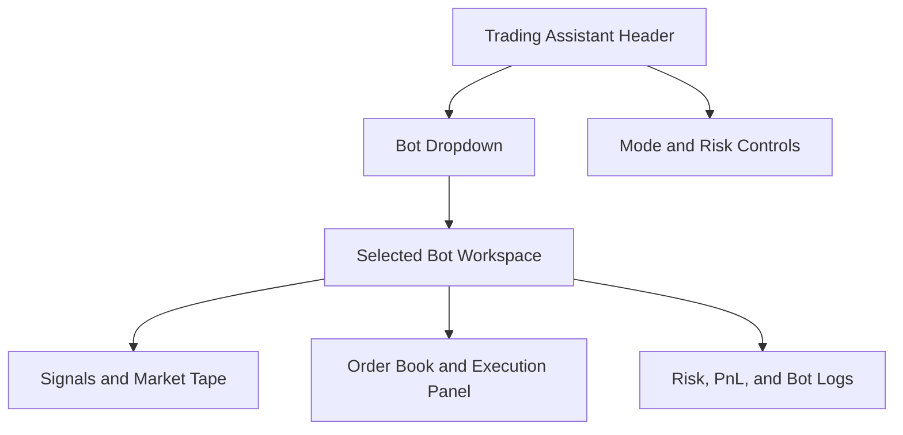

# Trading Bots Master Roadmap

Date: 2026-08-23
Branch: `trading_bot`
Status: Draft master spec

## Purpose

Create a durable planning document for all trading bot builds inside QuantMeridian. The first bot is a Polymarket trading assistant that starts with free/public Polymarket APIs, runs in read-only and paper-trading modes first, and only later supports authenticated live execution behind explicit risk gates.

This document tracks:

- Bot inventory, ownership, maturity, and next implementation steps.
- Shared terminal UX for selecting and operating bots.
- Data, API, risk, execution, and monitoring standards.
- The first full build plan: `POLYBOT`, a Polymarket trading bot using public Gamma/CLOB market data.

## Product Placement

Trading bots should not be buried under the existing `POLY` Prediction Markets module. `POLY` is a market intelligence surface. Bots are operational systems that need controls, mode selection, logs, limits, and execution state.

Add a new terminal navigation group:

| Field | Value |
|---|---|
| Group id | `TRADING_ASSISTANT` |
| Group label | `Trading Assistant` |
| Default route | `/trading-assistant` |
| Default bot | `POLYBOT` - Polymarket |
| Initial mode | `Research` or `Paper`, never live by default |
| Primary user action | Select bot, inspect signals, simulate orders, review risk |

Recommended nav item:

| Code | Label | Route | Group | Description |
|---|---|---|---|---|
| `TASSIST` | Trading Assistant | `/trading-assistant` | `TRADING_ASSISTANT` | Bot selector, signals, paper trading, execution controls |

The existing `POLY` module should remain in `INTELLIGENCE` as the prediction-market board. `POLYBOT` should reuse `POLY` data where possible, but the bot lives in `Trading Assistant` because its control surface is different.

## Master Bot Registry

| Bot code | Bot name | Market | Status | Default mode | Primary edge hypothesis | Data dependencies | Notes |
|---|---|---:|---|---|---|---|---|
| `POLYBOT` | Polymarket Bot | Prediction markets | Planned | Research/Paper | Mispriced probabilities, shallow liquidity, stale event reaction, cross-market inconsistencies | Polymarket Gamma API, CLOB order books, price history | First build |
| `KALSHI` | Kalshi Bot | Regulated event contracts | Backlog | Research | Event probability and calendar surprise pricing | Future API adapter | Keep separate from Polymarket due to venue/regulatory differences |
| `CRYPTO_MM` | Crypto Market Maker | Crypto spot/perps | Backlog | Research | Spread capture plus inventory skew | Future exchange adapter | Requires stronger execution controls |
| `MACRO_EVENT` | Macro Event Bot | Rates/macro assets | Backlog | Research | FOMC/CPI/NFP event pricing drift | FRED, calendar, market data | Could connect to existing `CAL`, `FOMC`, `MKT` |
| `NEWS_MOMO` | News Momentum Bot | Equities/ETFs/crypto | Backlog | Research | News attention plus price/volume confirmation | `NEWS`, `SENT`, market data | Signal-only until broker/exchange integration exists |
| `ETF_ROT` | ETF Rotation Bot | ETFs | Backlog | Research | Regime-based ETF rotation | Market pipeline, macro regime | Better as model portfolio before execution |

## Shared Trading Assistant UX

The screenshot reference suggests a dense trading command center: high information density, dark canvas, amber highlights, green/red market semantics, small status chips, compact charts, and multiple instrument panels. Match QuantMeridian's current terminal style rather than copying the screenshot exactly.

Design intent:

- Black canvas using the existing terminal background.
- Amber command accents for labels, active controls, section headers, and selected bot state.
- Green/red semantics for edge, P&L, probability change, fill quality, and risk status.
- Dense tabular numerics with minimal whitespace.
- Small status chips for `LIVE DATA`, `SIM`, `PAPER`, `SAFE`, `THROTTLED`, `KILL SWITCH`, and `STALE`.
- No glossy consumer trading-app aesthetic. This should feel like a compact institutional control surface.

### Required Header Controls

| Control | Type | Default | Requirement |
|---|---|---|---|
| Bot selector | Dropdown | `Polymarket` | Lives in the `Trading Assistant` group header and persists user selection |
| Mode selector | Segmented control | `Research` | `Research`, `Paper`, `Live`; `Live` disabled until execution adapter and credentials are configured |
| Universe filter | Dropdown/search | `Active markets` | Category, tag, volume, liquidity, close date, event type |
| Risk profile | Dropdown | `Conservative` | Conservative, Balanced, Aggressive, Custom |
| Refresh state | Status chip | `LIVE DATA` or `SIM` | Shows source and staleness |
| Kill switch | Button/chip | Armed in Paper/Live | Cancels live orders and pauses bot loops when execution exists |

### Suggested Layout



Desktop layout:

| Zone | Content |
|---|---|
| Top strip | Group label, bot dropdown, mode, risk profile, data provenance, UTC clock |
| Left column | Bot config, universe filters, strategy toggles, risk limits |
| Center top | Signal cards: edge, model probability, market probability, spread, depth, volume, confidence |
| Center middle | Market/event table and selected market details |
| Right column | Order book, simulated/live order ticket, position/risk summary |
| Bottom row | Probability chart, paper P&L, fills, warnings, bot run log |

Mobile layout:

| Priority | Content |
|---|---|
| 1 | Header with bot dropdown and mode |
| 2 | Active signal cards |
| 3 | Market/event list |
| 4 | Selected market order book |
| 5 | Risk/log drawer |

## Polymarket Bot Plan (`POLYBOT`)

### Objective

Build a Polymarket trading assistant that identifies prediction-market opportunities, explains why a market may be mispriced, simulates orders, and tracks paper P&L before any live execution path is enabled.

The first version should be useful even with no wallet, no private key, and no paid data vendor.

### API Strategy

Official Polymarket docs describe the API surface as:

| API | Base URL | Use in `POLYBOT` | Auth requirement |
|---|---|---|---|
| Gamma API | `https://gamma-api.polymarket.com` | Discover events, markets, tags, series, categories, metadata | Public/read-only |
| CLOB API | `https://clob.polymarket.com` | Read order books, midpoint, best bid/ask, spreads; later create/cancel orders | Public for market data, authenticated for trading |
| Data API | `https://data-api.polymarket.com` | User activity, positions, wallet/account analytics when configured | Public/profile plus authenticated paths depending endpoint |
| Relayer API | `https://relayer-v2.polymarket.com` | Future supported wallet transaction flow | Authenticated/future |

References:

- Polymarket API overview: https://docs.polymarket.com/api-reference/predictions/overview
- Discover markets: https://docs.polymarket.com/market-data/discover-markets
- Prices and order books: https://docs.polymarket.com/market-data/prices-order-books
- Get order book: https://docs.polymarket.com/api-reference/market-data/get-order-book
- Prices history: https://docs.polymarket.com/api-reference/markets/get-prices-history
- Trading quickstart: https://docs.polymarket.com/trading/quickstart

### Initial Bot Capabilities

| Capability | Description | Build priority |
|---|---|---:|
| Market discovery | Pull active, non-closed events and markets; filter by category, tag, volume, close date | P0 |
| Market detail view | Show question, outcomes, tokens, close date, volume, liquidity, tags, event grouping | P0 |
| Order book reader | Pull bids/asks for selected outcome token, compute midpoint, spread, depth, imbalance | P0 |
| Price history | Show probability path, momentum, realized probability volatility, drawdown from peak odds | P0 |
| Signal engine | Rank markets by estimated edge, liquidity, spread, staleness, and event urgency | P1 |
| Explanation layer | Explain signal drivers in plain English and quantitative fields | P1 |
| Paper trading | Simulate limit/market orders against current and historical books with slippage assumptions | P1 |
| Bot run log | Store run timestamp, input universe, signals generated, paper orders, warnings | P1 |
| Live execution | Authenticated CLOB order creation/cancel path with hard kill switch | P3 |

### Signal Stack

Start with transparent, non-ML signals before adding models. Prediction markets punish narrative confidence; a simple edge model with good risk controls is more valuable than a mysterious classifier.

| Signal | Formula / logic | Why it matters |
|---|---|---|
| Market probability | Best midpoint or last trade price for outcome token | Baseline crowd-implied probability |
| Spread penalty | `ask - bid` | Wide spreads reduce realizable edge |
| Depth score | Dollar depth within configurable bps from midpoint | Protects against false edge in thin markets |
| Volume/interest score | Recent volume, total volume, open interest where available | Helps avoid dead markets |
| Probability momentum | Short-window change in midpoint/history | Captures information flow and event repricing |
| Staleness flag | Book/hash/price unchanged while related events move | Finds markets that may not have reacted |
| Event urgency | Time to close/resolution and upcoming catalyst proximity | Event markets change behavior near close |
| Cross-market consistency | Related markets imply incompatible probabilities | Finds structural relative-value candidates |
| Model fair value | Optional user/model probability estimate | Converts opinion into measurable edge |
| Expected edge | `model_probability - executable_market_probability - cost_penalty` | Primary ranking field |

### Strategy Modules

| Strategy | Mode | Description | First implementation |
|---|---|---|---|
| `edge_scanner` | Research/Paper | Finds markets where model probability differs from executable price after spread/depth costs | P1 |
| `stale_reaction` | Research/Paper | Finds markets with stale books after related market or news movement | P1 |
| `relative_value` | Research/Paper | Compares related markets for inconsistent implied probabilities | P2 |
| `closing_decay` | Research/Paper | Tracks markets near close where probability drift, liquidity, and resolution timing create mispricing | P2 |
| `liquidity_maker` | Paper/Live later | Places passive quotes only when spread and inventory risk justify it | P3 |

### Risk Controls

`POLYBOT` must ship with safety defaults that make accidental live trading difficult.

| Risk control | Default | Requirement |
|---|---|---|
| Mode | Research/Paper | Live is disabled until credentials, limits, and kill switch pass checks |
| Max order size | `$5` paper default | Configurable per bot and per market |
| Max position per market | `$25` paper default | Hard cap before placing any order |
| Max daily loss | `$25` paper default | Pauses bot once breached |
| Min depth | Configurable | Do not trade if market cannot absorb order size |
| Max spread | Configurable | Do not trade when spread exceeds threshold |
| Close-date rules | Configurable | Restrict markets near resolution unless strategy explicitly allows |
| Manual approval | Required for live | Every live order requires approval until trusted automation is explicitly built |
| Kill switch | Always visible | Cancels open orders and pauses bot loop |
| Region/ToS check | Required before live | User must confirm eligibility and platform terms before execution |

### Data Contracts

Proposed TypeScript shapes:

```ts
export type TradingBotMode = "research" | "paper" | "live";

export interface TradingBotDefinition {
  code: string;
  label: string;
  venue: string;
  defaultMode: TradingBotMode;
  status: "planned" | "research" | "paper" | "live" | "paused";
  strategies: string[];
  dataSources: string[];
}

export interface BotSignal {
  botCode: string;
  marketId: string;
  outcomeTokenId: string;
  signalType: string;
  marketProbability: number;
  modelProbability?: number;
  executablePrice?: number;
  expectedEdge?: number;
  spread?: number;
  depthScore?: number;
  confidence: "low" | "medium" | "high";
  warnings: string[];
  asOf: string;
}

export interface OrderIntent {
  botCode: string;
  mode: TradingBotMode;
  marketId: string;
  outcomeTokenId: string;
  side: "buy" | "sell";
  orderType: "limit" | "market";
  price?: number;
  sizeUsd: number;
  rationale: string;
  riskChecks: string[];
}
```

### Proposed API Endpoints

| Endpoint | Method | Purpose | Mode |
|---|---|---|---|
| `/api/trading-assistant/bots` | `GET` | Bot registry and enabled bot list | All |
| `/api/trading-assistant/polymarket/events` | `GET` | Active event discovery via Gamma | Research/Paper |
| `/api/trading-assistant/polymarket/markets` | `GET` | Market list with filters | Research/Paper |
| `/api/trading-assistant/polymarket/book` | `GET` | CLOB order book by outcome token | Research/Paper |
| `/api/trading-assistant/polymarket/history` | `GET` | Probability/price history | Research/Paper |
| `/api/trading-assistant/polymarket/signals` | `GET` | Ranked bot signals | Research/Paper |
| `/api/trading-assistant/paper/orders` | `POST` | Simulated order creation | Paper |
| `/api/trading-assistant/paper/positions` | `GET` | Paper positions and P&L | Paper |
| `/api/trading-assistant/live/orders` | `POST` | Future authenticated live order path | Live only, disabled initially |
| `/api/trading-assistant/kill-switch` | `POST` | Pause bot and cancel live orders when supported | Paper/Live |

### UI Acceptance Criteria

- `Trading Assistant` appears as its own terminal group in navigation.
- The group header contains a bot dropdown with `Polymarket` selected by default.
- The dropdown is designed to support future bots without changing the page architecture.
- Mode defaults to `Research` or `Paper`; `Live` is visibly unavailable until configured.
- Selecting `Polymarket` loads the `POLYBOT` workspace.
- The workspace uses QuantMeridian terminal styling: black canvas, amber active controls, green/red semantics, dense panels, status chips, compact charts.
- The UI includes clear provenance labels for `LIVE POLYMARKET`, `CACHED`, and `SIM` states.
- The selected market view shows signal, price/probability chart, order book, depth, spread, and paper ticket.
- The bot log records all signal generation and paper order actions.

### Implementation Phases

#### Phase 0 - Spec and registry

- Create this master roadmap.
- Add `TRADING_ASSISTANT` nav group to `src/lib/nav.ts`.
- Add `TASSIST` nav item pointing to `/trading-assistant`.
- Add bot registry seed data with `POLYBOT` as default.

#### Phase 1 - Read-only Polymarket workspace

- Build `TradingAssistantPage` route.
- Add bot dropdown and mode selector.
- Implement Polymarket event/market discovery adapter.
- Reuse existing `POLY` patterns where available.
- Add selected market detail, order book, price history, and data provenance.

#### Phase 2 - Signal engine and paper trading

- Add signal ranking endpoint.
- Add configurable signal weights.
- Add paper order simulation and paper position ledger.
- Add run logs, warnings, and paper P&L.

#### Phase 3 - Strategy expansion

- Add stale reaction scanner.
- Add relative value scanner across related events/markets.
- Add closing decay module.
- Add watchlists and alerts.

#### Phase 4 - Live execution gate

- Add authenticated CLOB adapter only after paper mode is stable.
- Store credentials server-side only; never expose keys to client bundles.
- Require explicit live-mode enablement, manual approval, order caps, max daily loss, and kill switch.
- Add audit trail for every submitted, canceled, rejected, and filled order.

## Test Plan

| Layer | Tests |
|---|---|
| Unit | Bot registry defaults, risk checks, signal formulas, price/probability transforms |
| API | Polymarket adapter fallback, schema validation, stale/cached response handling |
| UI | Dropdown default, mode gating, live disabled state, mobile layout, provenance chips |
| Paper trading | Fill simulation, P&L ledger, risk caps, daily-loss stop |
| Execution later | Credential absence blocks live, kill switch blocks orders, max order size rejects |

## Open Questions

- Should `Trading Assistant` be placed after `Trading Desk` or after `Intelligence` in the nav order?
- Should `POLYBOT` initially share `/polymarket` data functions or get a separate adapter layer immediately?
- Should paper P&L persist in local storage, committed JSON fixtures, or a lightweight server-side store?
- What default categories should the Polymarket bot monitor first: macro, crypto, politics, sports, earnings, or all active markets above a volume threshold?
- Should user-supplied model probabilities be manual inputs first, or should the bot derive them from QuantMeridian macro/news modules?

## First Build Recommendation

Start with a narrow, high-quality read-only and paper-trading bot:

1. `Trading Assistant` group with `Polymarket` default dropdown.
2. Active Polymarket markets filtered by volume, liquidity, category, and close date.
3. Selected market detail with order book, probability chart, spread/depth, and signal explanation.
4. Signal ranking based on spread-adjusted edge, liquidity, staleness, and event urgency.
5. Paper order ticket with max-order, max-position, and max-loss controls.

Do not start with live execution. The faster path to a credible bot is to make the signal engine measurable, auditable, and wrong in ways you can learn from before attaching a wallet.
